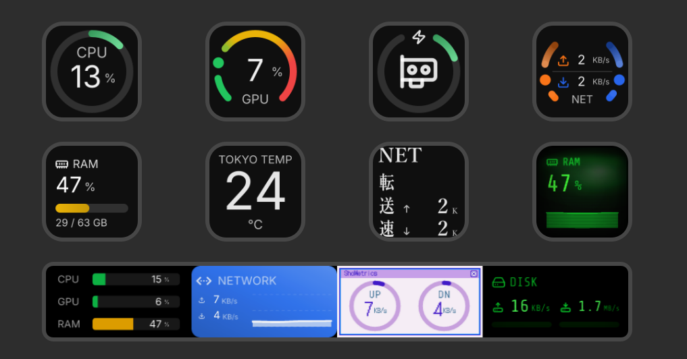
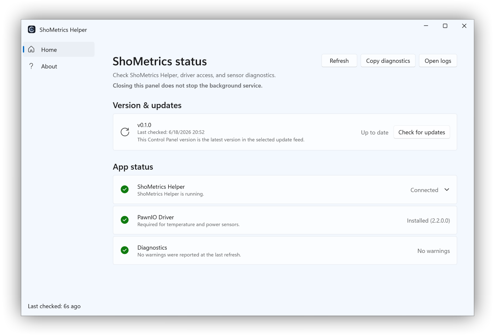

# Sho Metrics

Sho Metrics is a Stream Deck plugin for displaying live system metrics on Stream Deck keys.

It supports Windows and macOS, with built-in metrics for CPU, GPU, memory, disk, network, and custom HTTP JSON endpoints. On Windows, an optional helper unlocks deeper LibreHardwareMonitor-backed sensors such as AMD/Intel GPU metrics, temperatures, fan speeds, and voltages.





## Features

- Monitor CPU, GPU, memory, disk, network speed, network latency, and custom HTTP JSON metrics.
- Choose from multiple views: circle, text, linear bar, and sparkline.
- Style metrics with themes such as default, color filled, terminal, pixel window, and glass.
- Combine any supported view with any supported theme.
- Use dense and stacked metric widgets to fit more information onto fewer keys.
- Apply a global style overlay without overwriting per-key settings.
- Adjust widget colors with color compensation for physical Stream Deck keys.

## Metrics

Sho Metrics works without admin privileges for basic metrics.

Built-in sources include:

- CPU usage
- GPU usage for supported platforms
- Memory usage
- Disk usage and throughput
- Network upload/download speed
- Network latency
- Custom metrics from HTTP JSON endpoints

On Windows, the optional helper can expose additional hardware-backed metrics through LibreHardwareMonitor. Install it only if you need deeper sensor coverage.

## Custom HTTP Metrics

Custom HTTP metrics let Sho Metrics display values from any HTTP endpoint that returns JSON. You provide the endpoint and a jq filter that selects the value to display.

Examples include Home Assistant sensors, local weather data, homelab status endpoints, or any service that can return JSON.

See the custom HTTP metric guide:

https://shometrics.github.io/faq/custom-http-metric/

## Installation

Install the Stream Deck plugin first. Most users should start there.

If you need the optional Windows helper, download it from:

https://shometrics.github.io/download/

Helper details:

https://shometrics.github.io/faq/helper/

## Documentation

- FAQ: https://shometrics.github.io/faq/

## Development

Start with the command playbook before running setup, build, test, packaging, or release commands:

[docs/development/command-playbook.md](docs/development/command-playbook.md)

Project contribution rules are in:

- [CONTRIBUTING.md](CONTRIBUTING.md)
- [AGENTS.md](AGENTS.md)
- [.agents/skills](.agents/skills)

For hub development, common commands run from `packages/hub`:

```powershell
npm run build
npm run test:unit
npm run proto:lint
```

For Windows helper development, use the commands listed in the command playbook.

## Acknowledgements

Sho Metrics is built on excellent open-source projects, including:

- [LibreHardwareMonitor](https://github.com/LibreHardwareMonitor/LibreHardwareMonitor), which powers the optional Windows helper's deeper hardware sensor support.
- [Lucide](https://github.com/lucide-icons/lucide), used for icons in the plugin UI and rendered widgets.
- [systeminformation](https://github.com/sebhildebrandt/systeminformation), used for cross-platform system metrics.
- [resvg-js](https://github.com/yisibl/resvg-js), used for SVG rasterization.

See package-level third-party notices for license details.

## License

Sho Metrics is free and open source. See [LICENSE](LICENSE).
